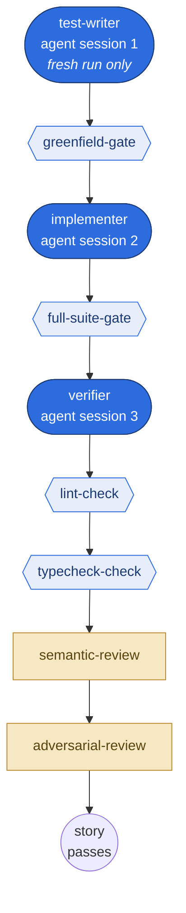
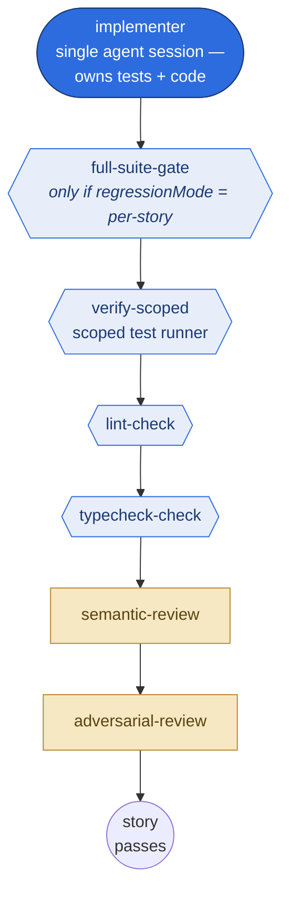
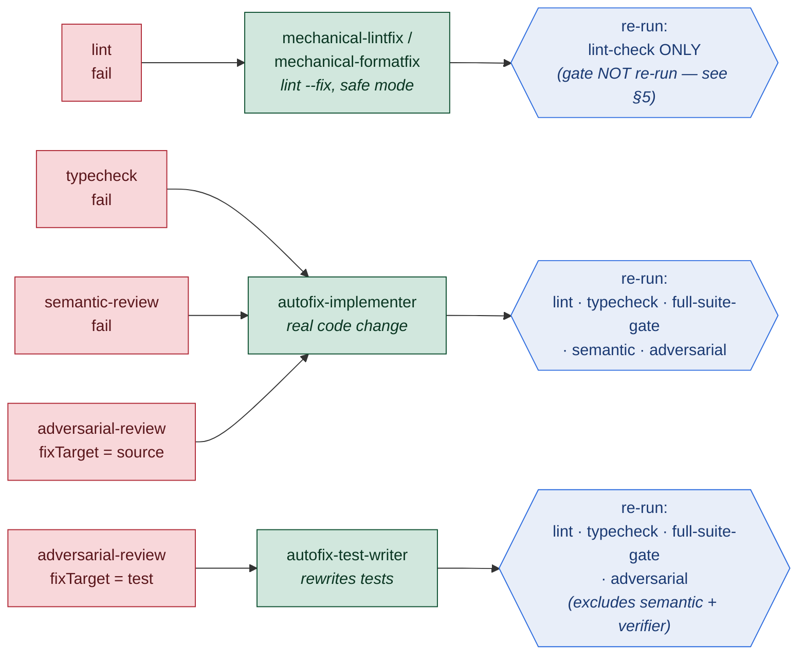

# Story Orchestrator Flow

> **Purpose:** End-to-end reference for how a single story is executed inside `executionStage` —
> the per-story phase ordering, the three-session vs single-session modes, and the
> review → fix → revalidation cycle (mechanical / semantic / adversarial).
>
> **Scope:** This is the SSOT for "what runs, in what order, and what re-runs after a fix."
> It complements §17 (Pipeline), §19 (TDD), §21 (Verification), and §25 (Review) in
> [subsystems.md](subsystems.md) — those describe the subsystems; this describes the **control flow**
> that wires them together per story.

---

## 1. Where this fits

Each story runs inside the pipeline's `executionStage`
(`src/pipeline/stages/execution.ts`). That stage delegates per-story work to the
**Story Orchestrator** (`src/execution/story-orchestrator.ts`), which executes an
ordered list of **phases** and, on failure, drives a **rectification (fix) cycle**
(`src/findings/cycle.ts`) before deciding the story's verdict.

```
executionStage  [src/pipeline/stages/execution.ts]
  → buildPlanForStrategy()           [src/execution/build-plan-for-strategy.ts]  — assembles the phase list
  → StoryOrchestrator.run()          [src/execution/story-orchestrator.ts]       — runs phases in CANONICAL_ORDER
      → runPhase() per phase, short-circuit on failure
      → on failure: runFixCycle()    [src/findings/cycle.ts]                     — fix + narrow revalidation
      → post-rectification resume + staleness guard → final verdict
```

---

## 2. Canonical phase order

The orchestrator runs phases in this fixed order, short-circuiting on the first
failure (no phase runs against broken code):

`src/execution/story-orchestrator.ts:259`

```typescript
const CANONICAL_ORDER: readonly PhaseKind[] = [
  "test-writer",        // agent session 1 (three-session only)
  "greenfield-gate",    // deterministic gate (three-session only)
  "implementer",        // agent session 2 (always)
  "full-suite-gate",    // deterministic gate
  "verifier",           // agent session 3 (three-session only)
  "verify-scoped",      // deterministic gate (single-session only)
  "lint-check",         // mechanical check
  "typecheck-check",    // mechanical check
  "semantic-review",    // LLM review
  "adversarial-review", // LLM review
];
```

### Phase taxonomy

| Kind | Phases | Nature |
|:---|:---|:---|
| **Agent session** | `test-writer`, `implementer`, `verifier` | A real LLM session that writes/edits code or tests |
| **Deterministic gate** | `greenfield-gate`, `full-suite-gate`, `verify-scoped` | No LLM — filesystem scan or test-runner execution |
| **Mechanical check** | `lint-check`, `typecheck-check` | No LLM — runs the configured lint / typecheck command |
| **LLM review** | `semantic-review`, `adversarial-review` | An LLM judges the diff (quality / bug-hunting) |

Gate one-liners:
- **greenfield-gate** — filesystem scan: does the story already have test files? If not (greenfield), pause and skip the test-writer (BUG-010). `src/operations/greenfield-gate.ts`
- **full-suite-gate** — runs the full test suite, returns structured pass/fail findings. `src/operations/full-suite-gate.ts`
- **verify-scoped** — single-session only: runs a *scoped* test selection (smart-runner change detection) instead of a separate verifier session.

---

## 3. Three-session vs single-session

The mode is selected by **`routing.testStrategy`**, classified by
`isThreeSessionStrategy()` in `src/config/test-strategy.ts:50`:

```typescript
export const THREE_SESSION_STRATEGIES = new Set([
  "three-session-tdd",
  "three-session-tdd-lite",
]);
```

| `testStrategy` value | Mode | Notes |
|:---|:---|:---|
| `no-test` | single | no tests |
| `test-after` | single | implementer writes tests *after* code |
| `tdd-simple` | single | implementer writes a failing test, then code |
| `three-session-tdd` | **three** | strict test-writer isolation |
| `three-session-tdd-lite` | **three** | permissive test-writer (may create src stubs) |

The phase list is assembled conditionally in **`buildPlanForStrategy()`**
(`src/execution/build-plan-for-strategy.ts:87`), keyed off
`isThreeSession = isThreeSessionStrategy(testStrategy)` (line 94) and
`freshRun = isFreshRun(story)` (line 95):

```typescript
if (isThreeSession && freshRun && inputs.testWriter)     builder.addTestWriter(...);      // :100
if (isThreeSession && freshRun && inputs.greenfieldGate) builder.addGreenfieldGate(...);  // :103
builder.addImplementer(...);                                                              // always
if (inputs.fullSuiteGate && (isThreeSession || regressionMode === "per-story"))
                                                          builder.addFullSuiteGate(...);  // :114
if (isThreeSession && inputs.verifier)                   builder.addVerifier(...);        // :117
if (!isThreeSession && inputs.verifyScoped)              builder.addVerifyScoped(...);    // :122
// lint-check, typecheck-check, semantic-review, adversarial-review added when inputs present
```

### Three-session mode

Three distinct agent sessions, separated by deterministic gates:

```
[test-writer]  → greenfield-gate → [implementer] → full-suite-gate
→ [verifier]   → lint-check → typecheck-check → semantic-review → adversarial-review
       (agent sessions in brackets)
```



> **Legend** — rounded blue = LLM agent session · hexagon = deterministic gate / mechanical check · rectangle = LLM review. Any phase failing short-circuits the chain and enters the fix cycle (§4).

- **test-writer** — writes failing tests; isolated from implementation (strict) or may stub src (lite). Model tier: `tdd.sessionTiers.testWriter`.
- **implementer** — writes the implementation to make tests pass. Model tier: **`story.routing.modelTier`** (routing-driven; escalation mutates it — *not* `sessionTiers.implementer`, which is intentionally unused).
- **verifier** — confirms the TDD boundary held (tests genuinely exercise the implementation). Model tier: `tdd.sessionTiers.verifier`.

`test-writer` and `greenfield-gate` only run on a **fresh** run; resumed stories skip
straight to the implementer.

### Single-session mode

One agent session (the implementer) owns both tests and code; there is no separate
test-writer or verifier. `verify-scoped` replaces the full verifier session:

```
[implementer] → [full-suite-gate?] → verify-scoped
→ lint-check → typecheck-check → semantic-review → adversarial-review
```



> No separate test-writer or verifier sessions — `verify-scoped` (a deterministic scoped
> test runner) replaces the verifier. Same legend as above.

- No `test-writer`, no `greenfield-gate`, no `verifier`.
- `full-suite-gate` runs only when `regressionMode === "per-story"`; otherwise scoped verification is the test gate.
- The implementer session is `lifetime: "warm"` so autofix strategies can resume it during rectification.

### Model-tier resolution (where to look)

`src/config/runtime-types.ts:260` — `TddConfig.sessionTiers`:

```typescript
sessionTiers?: {
  testWriter?: ConfiguredModel;   // optional override, default "fast"
  implementer?: ConfiguredModel;  // INTENTIONALLY UNUSED — implementer is routing-driven
  verifier?: ConfiguredModel;     // optional override, default "fast"
};
```

> Note: `sessionTiers.implementer` exists in the schema but is never consumed — the
> implementer always follows `routing.modelTier` + escalation. See the per-role
> model-tier semantics note in project memory.

---

## 4. Review → fix → revalidation cycle

When any phase fails, it emits `Finding[]` tagged with a `source`. The rectification
loop (`src/findings/cycle.ts`) selects a **fix strategy** whose `appliesTo` matches the
finding's `source`/`fixTarget`, applies the fix, then **re-runs only a declared subset
of phases** — not the whole canonical order.

That subset is the SSOT map **`STRATEGY_TO_REVALIDATION_PHASES`**
(`src/execution/story-orchestrator.ts:484`). So "what re-runs after a fix?" depends on
**which strategy fired**, not on which phase originally failed.

| Phase that failed | `source` | Fix strategy | Revalidation set (what re-runs) |
|:---|:---|:---|:---|
| lint-check | `lint` | `mechanical-lintfix` / `mechanical-formatfix` | **`lint-check` only** |
| typecheck-check | `typecheck` | `autofix-implementer` | lint, typecheck, full-suite-gate, semantic, adversarial |
| semantic-review | `semantic-review` | `autofix-implementer` | lint, typecheck, full-suite-gate, semantic, adversarial |
| adversarial-review (source) | `adversarial-review`, `fixTarget: source` | `autofix-implementer` | lint, typecheck, full-suite-gate, semantic, adversarial |
| adversarial-review (test) | `adversarial-review`, `fixTarget: test` | `autofix-test-writer` | lint, typecheck, full-suite-gate, adversarial — **excludes semantic & verifier** |



> **Read:** failed phase (red) → fix strategy that claims it (green) → the revalidation set
> that re-runs (blue). The map is `STRATEGY_TO_REVALIDATION_PHASES`
> (`story-orchestrator.ts:484`); an unknown/plugin strategy falls back to re-running **all** phases.

### Why the asymmetry

- **Mechanical lint/format fixes** are expected to be AST-/semantics-preserving, so only
  `lint-check` re-runs (cheapest). `maxAttempts: 1`. (See the soundness assumption in §5.)
- **Any agent-written code fix** (typecheck / semantic / adversarial-source) can break
  anything, so it re-runs the full downstream chain: style → types → tests → both reviews.
- **Test rewrites** (`autofix-test-writer`) re-run tests + adversarial re-judgment, but:
  - skip `semantic-review` (semantic review judges *source*, not tests), and
  - skip `verifier` **by intent** — re-running the verifier is an extra agent session
    (cost), and a test rewrite is not expected to invalidate the TDD-boundary judgment
    enough to justify it.

### Conservative fallback

`phasesToRevalidate()` (`src/execution/story-orchestrator.ts:525`): if `strategiesRun`
is empty, or contains any strategy **not** in the map (e.g. a plugin strategy), it
returns **all** phases — re-run everything. The narrow sets are an optimization layered
over a safe default.

### Loop caps & exit

- Mechanical strategies: `maxAttempts: 1`. Code-fix strategies:
  `config.execution.rectification.maxAttemptsPerStrategy`; overall cap `maxAttemptsTotal`.
- Exit reasons (`src/execution/story-orchestrator.ts:61`, `EXHAUSTED_EXIT_REASONS`):
  `max-attempts-total`, `max-attempts-per-strategy`, `no-strategy`, `agent-gave-up`,
  `validate-short-circuit`, `bail-when`.
- **`agent-gave-up`** fires when a fix-op emits the `UNRESOLVED:` sentinel (the implementer
  signalling a contradiction it cannot resolve — e.g. `full-suite-rectify` and
  `autofix-implementer` both parse it). The sentinel's reason text is carried as
  `unresolvedDetail` through `RectificationResult` → `StoryOrchestratorResult` →
  `decideStageAction`, which surfaces it in the escalation reason
  (`"Rectification exhausted: <detail>"`) so the next tier's `priorErrors` carries the
  diagnosis. When a fix-op emits both `UNRESOLVED:` and a test-edit declaration, the
  declaration wins (the test-writer handoff runs instead of giving up).
- **Terminal lite-validate**: when a strategy exhausts its attempts, a final "lite"
  validate re-orders phases so `full-suite-gate` runs **last** (`orderGateLast()`, `:552`).

### Post-rectification resume & staleness guard

- **Resume loop** (`:1144`): after the cycle exits, the orchestrator walks the canonical
  order again and runs any phase that has **not** already passed. A phase already in
  `phaseOutputs` that passed is skipped:
  `if (name in phaseOutputs && phasePassed(...)) continue;` (`:1156`). A *fresh*
  never-before-seen failure triggers one additional second rectification pass per story.
- **Verifier-SSOT carve-out** (`:439`): once `verifier` explicitly passes, later
  `full-suite-gate` failures are treated as unrelated regressions and do not block — but
  the **staleness guard** (`:1297`) re-fails the story if rectification introduced *new*
  gate failures (post-hoc detection, not re-execution).

---

## 5. Soundness note: `mechanical-lintfix` does not re-run the gate

This is a deliberate, load-bearing assumption worth calling out explicitly.

**Observed behavior (verified by code trace):** after a `mechanical-lintfix` cycle,
`full-suite-gate` is **never re-run**.

- `mechanical-lintfix → ["lint-check"]` only (`:488`) — the validate callback re-runs
  lint-check alone.
- `full-suite-gate` passed earlier at canonical position 4, so it sits in `phaseOutputs`
  as passed. The resume loop skips it (`:1156`), and the mechanical-only resume path also
  skips it (`if (name in phaseOutputs) continue;`, `:1226`).
- The staleness guard (`:1297`) only *detects* a gate regression post-hoc; it does **not**
  re-execute the gate.

**Implication:** the soundness of `mechanical-lintfix → ["lint-check"]` rests entirely on
the assumption documented in the code comment (`:485`):

> "Mechanical fixes are AST-preserving (import-sort, formatting, unused-var removal).
> They cannot introduce semantic regressions, so only lint-check needs re-running."

If the configured lint-fix command could change runtime behavior (e.g. an `eslint --fix`
rule that removes an "unused" import with a side effect, or removes an unused variable
whose initializer had a side effect), that break would ship silently — nothing
downstream re-runs the tests within the story.

**Why this is acceptable in practice (current assumption):** nax's mechanical fix is run
in **safe mode**. With **Biome** specifically, the dangerous transforms are *unsafe*
fixes and are **not applied by default** — e.g. unused-import / unused-variable removal
is classified as an unsafe fix and is unfixable in the default (safe) fix mode. So the
default mechanical-lintfix only applies semantics-preserving (safe) transforms, which
keeps the "AST-preserving" assumption true for the supported toolchain.

**What to watch:** this guarantee is **tool- and config-dependent**. It holds for Biome
safe-fix; it is *not* automatically true for arbitrary `lint --fix` commands in other
languages/toolchains (nax is polyglot, and the lint command is config-driven per
package). If a package configures a lint-fix command that applies unsafe transforms, the
options are either:

1. constrain the mechanical fix to format-only / safe-fix transforms, or
2. add `full-suite-gate` to the `mechanical-lintfix` revalidation set.

---

## 6. Quick reference

| Question | Answer | Source |
|:---|:---|:---|
| What selects three vs single session? | `routing.testStrategy` via `isThreeSessionStrategy()` | `src/config/test-strategy.ts:50` |
| Where is the phase list assembled? | `buildPlanForStrategy()` | `src/execution/build-plan-for-strategy.ts:87` |
| Canonical phase order | `CANONICAL_ORDER` | `src/execution/story-orchestrator.ts:259` |
| What re-runs after a fix? | `STRATEGY_TO_REVALIDATION_PHASES` | `src/execution/story-orchestrator.ts:484` |
| Conservative re-run fallback | `phasesToRevalidate()` | `src/execution/story-orchestrator.ts:525` |
| Cycle exit reasons | `EXHAUSTED_EXIT_REASONS` | `src/execution/story-orchestrator.ts:61` |
| Implementer model tier | `story.routing.modelTier` (not `sessionTiers.implementer`) | `src/config/runtime-types.ts:260` |
| Does the gate re-run after lint-fix? | **No** — early pass trusted; safe via Biome safe-fix mode | §5 above |

---

*Created: 2026-06-14. Maintained by nax-dev.*
